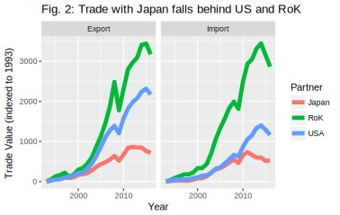
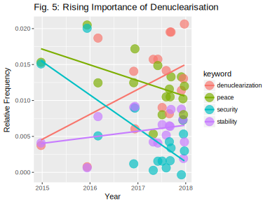

# Chinese Foreign Policy Priorities in the Korean Peninsula

## Introduction

​	In this paper I will explore how China's perceptions and foreign policy priorities change in response to different degrees and types of provocation on the Korean peninsula. The Korean peninsula has been host to significant and frequent military exercises, missile tests, and nuclear tests. China has been given a unique opportunity to demonstrate regional leadership, and a challenge to protect its own security. Historically, China has remained opaque about its foreign policy. This behavior is best explained by Deng Xiaoping's '24 character strategy' [^tf-character]:

>Observe calmly; secure our position; cope with affairs calmly; hide our capabilities and bide our time; be good at maintaining a low profile; and never claim leadership.

This paper aims to reveal how China has balanced its foreign policy goals in the presence of multipolar military provocation and economic stake on the Korean Peninsula. In doing so, it will answer the question: at what point do the stakes of economic integration fail to hold broader geopolitical ambitions?

​	First, I will investigate the role of China's trade relationships and economic interdependence in the context of the Korea peninsula. There are likely two extremes that these trade relationships fall under: (i) incentives for peaceful relationships and (ii) policy options to achieve foreign policy goals. These two extremes reflect the idea that under ideal conditions China would want to maximize its gains from trade, but when other priorities are perceived to be more important, the state may forego gains in the short term. In essence, there is a dichotomy of economic interdependence being a priority unto itself as well as a means to achieve other priorities.

​	I hypothesize that Chinese trade relationships with the United States and Republic of Korea (RoK) act predominantly as incentives for a peaceful relationship, while the relationships with the Democratic People's Republic of Korea (DPRK) and Japan are more commonly used as policy tools to achieve other goals. In the case of the DPRK, these goals may include a peace treaty or denuclearization on the Korean peninsula. In the case of Japan, they may relate to the Korean peninsula or to disputed territories. This assumption is based on how important the United States and RoK are as trading partners with China, relative to Japan and the DPRK. Japan and the DPRK have a weaker bargaining position with China; thus, the two countries are more vulnerable to Chinese attempts at leveraging its economic power. I expect that increased levels of provocation have an inverse relationship with the trade flows between China and the DPRK.

​	Next, this paper will evaluate how important China considers denuclearization relative to its other foreign policy goals. By examining Chinese diplomatic messaging, including UN Security Council speeches, we can infer the relative importance of denuclearization in China's foreign policy agenda. UNSC speeches offer an important opportunity for China to signal its priorities to actors active on the Korean peninsula, since many of them have ambassadors sitting on the Council. Although this stated preference model relies on China's diplomats to be somewhat transparent about their priorities, they have every incentive to do so given the signalling power of the speeches. I predict that in the presence of accelerating nuclear-related provocation, Chinese messaging on the issue becomes stronger and more focused on specific denuclearization efforts.

​	Main findings of this research include: growth in annual China-RoK trade is negatively associated with frequency of US-RoK military exercises in a given year, growth in annual China-DPRK trade is not associated with frequency of missile or nuclear provocations in a given year, and growth in annual US-China trade is not associated with military exercises, missile provocations, and nuclear provocations. The most significant provocation factor that affects China's trade relationships is US-RoK military exercises. This suggests a chief concern of China about events on the Korean peninsula is the level of US influence in the region. Furthermore, the lack of association between China-DPRK trade and provocation events implies that the trade relationship is strong despite relatively low levels of economic integration. China's interest in a trade relationship with the DPRK may be indicative of a balancing effort against US influence, or it could be related to ideological ties between the two states. This analysis will contribute perspective on how a regional power reacts to a crisis when it has several roles, including leader, mediator, and stakeholder. This has potential to offer two key inferences: how China and other regional powers may behave in other similarly provocative situations, and which factors are determinants of this behavior.

## Literature Review and Theory

​	Economic interdependence can serve as both a foreign policy priority itself and a tool to achieve other priorities. Some perspectives argue that the incentive component of economic interdependence is better at explaining states' behavior, but others contend that it is not strong enough to outweigh other priorities. While there are theoretical perspectives and events that support both sides of the economic interdependence dichotomy, the evidence that it is a dominant foreign policy priority is increasingly better at explaining Chinese relationships relevant to the Korea peninsula. Despite China's current and past attempts to use economic leverage to achieve its foreign policy priorities, I believe that economic interdependence acts primarily as an incentive for mutualistic relationships.

​	In 2010, John Mearsheimer provided a theoretical perspective that predicted China's modernization would lead to the state seeking regional hegemony and using its position of power to achieve its foreign policy priorities.[^mearsheimer] Although Mearsheimer's analysis focused on the Chinese challenge to the power of the United States in the region, the perspective predicts that China would use its economic interdependence with its neighbors to achieve specific foreign policy goals, rather than allowing that economic interdependence to determine the state's priorities.

​	There is support for this prediction in recent events regarding the peninsula, particularly in the case of the China-DPRK relationship. However, I believe these events are outliers to the general case; China will increasingly prioritize its trade relationships higher in its foreign policy as it continues to modernize and increase its economic interdependence with states such as the RoK. One of the most prominent examples of China using its economic leverage to achieve other foreign policy priorities occurred in 2017. In the first quarter of the year, China reported a substantial and mostly export driven increase in trade with North Korea of 37.4%, despite a ban on coal imports put in place in February.[^trade-early-2017] In the following months, the North Korean regime initiated several missile tests, and by the end of the year China-DPRK trade saw a reduction of 10.5% compared to 2016.[^trade-2017] Furthermore, the DPRK Budget Report for 2017 noted a slow down in economic growth in special economic zones, which are an important source of economic interdependence with China.[^budget-report]

​	This example demonstrates that China does not hesitate to use its trade relationships as tools to achieve foreign policy priorities; indeed, this is some of the strongest evidence to support such an idea. However, there is good reason to believe that the China-DPRK trade relationship is unlike many of its other relationships. Trade with the North Korean regime is only a small portion of China's economy, and in a situation with stronger economic interdependence the results may be quite different.

​	In the case of the Republic of Korea, we observe how one of China's stronger trade relationships responds to security tensions. In 2017, China attempted to use economic leverage against the RoK in response to the deployment of the THAAD missile defense system.[^glaser-collins] However in this instance, the effort had considerably less impact and the sanctions were removed in a short time frame. Before reconciliation of the dispute, China claimed that the RoK made three commitments.  Called the 'three nos', the commitments ruled out US missile defense system integration, a trilateral military alliance with the US and Japan, and no additional deployments of THAAD. According to the RoK, these commitments were not promises made to China, but instead long standing foreign policy. Importantly, the 'three nos' did not include a walk back of the existing THAAD deployments in the RoK. In the case of the DPRK, there have been commitments to close nuclear test sites.[^nuclear-test-site] While China may attempt to use economic leverage to its advantage, the success of this policy will be limited for trade relationships that are highly interdependent.

​	There are convincing theoretical perspectives that support the notion of economic interdependence being an incentive for cooperative relationships and a goal unto itself. For example, the democratic peace theory stresses that interdependence and strong trade relationships create opportunities for communication by fostering cross-border social and business ties.[^rand] In this perspective, well connected interests have too much to lose from instability and pressure their respective states to deescalate economic conflict. This process has echoes of intergroup contact theory, which has shown contact between different cultural groups to lead to lower levels of prejudice.[^contact-theory] The presence of decreased prejudice among economic leaders could plausibly complement the strong incentives for peace, diminishing the influence of national identity on the process of dispute resolution. However, this only occurs when the economies in question are sufficiently well connected and integrated. Thus, China may selectively continue to use economic leverage only on states and actors it is only marginally connected with.

​	According to Avery Goldstein, the economic and institutional ties between China and North East Asian actors such as the US and RoK are so central to China's continued modernization that it is unlikely they will be sacrificed for other foreign policy priorities.[^goldstein] He points to the increasing willingness of China to fulfill a leadership position, through both public and discrete diplomatic missions and negotiations, as evidence of the strength of these ties. Furthermore, Goldstein notes that Chinese statements have emphasized the need to contain, rather than counter, tensions. This aligns with a 2017 Council on Foreign Relations report that claims one of China's top priorities for the Korean peninsula is stability.[^council-foreign-relations]

​	If it is true that economic interdependence plays such a dominant role in China's geopolitical calculus, then options to pursue other foreign policy goals such as denuclearisation become limited. Last year, Nicholas Anderson published a paper describing an intriguing idea of a 'nuclear trilemma' for the US on the Korean peninsula. In the paper, he asserts that the US cannot achieve denuclearisation without going to war or abandoning forward deployment in Korea.[^anderson] While this trilemma may not exist, the tradeoffs outlined by Anderson are thought provoking. China likely faces similar tradeoffs in its foreign policy, and it is unclear when these tradeoffs will lead to economic incentives being deprioritized.

​	Theoretical perspectives that stress the assertiveness of China imply that economic interdependence is less of a dominant priority and more likely to be affected by underlying security conditions. On the other hand, the perspectives that stress the importance of economic interdependence in contributing to China's modernization and diplomacy efforts would posit that the state's trade relationships are less likely to be affected by other foreign policy priorities such as security concerns.

## Research Design

​	In determining the role of economic interdependence, I use a model that defines China's trade relationships with the DPRK, RoK, USA, and Japan as the dependent variable. Annual growth in combined exports and imports represents the importance China places on economic interdependence with each of these countries. In the model, the independent variables are the frequency of different types of provocations, which represent events that contribute to China's security concerns and non-economic foreign policy goals. The analysis controls for China's growth in trade with the world to account for underlying global economic conditions that may affect China's trade growth with the states of focus.

​	The annual growth in exports and imports to and from each trade partner is used to measure the progress and status of the trade relationships, representing how important China perceives economic interdependence with the given trade partner. Other ways of measuring this include frequency of punitive economic sanctions, or amount of cross-country investment. In the former case, there are not enough observations available for an effective analysis, and quantifying individual economic sanctions would be inexact. Furthermore, cross-country investment is not particularly relevant in the case of the DPRK, since their centrally planned economy does not allow for much foreign investment. From the UN Comtrade Database, yearly data for imports and exports in dollars between China and its trade partners is available.[^comtrade] From this data, I generated annual figures for trade growth, expressed as a percentage increase in total value of the flow in question relative to the previous year. There are two measures of trade growth used in my models: combined export and import growth and export growth only. The former is a more robust and holistic measure of the trade relationship, while the latter is more sensitive to external shocks to the partner's exports which could affect the state's capacity for importing from China. Nevertheless, the latter measure can be useful because it still includes the impact of embargoes.

​	Provocations by the DPRK, RoK, and the USA serve as the independent variable, representing geopolitical circumstances undesirable from the perspective of China. There are three major types of provocations relevant to this analysis: military exercises (RoK and USA), missile provocations (DPRK), and nuclear provocations (DPRK). The provocation data is compiled by BeyondParallel, a project which strives to be a central source for unbiased information relating to Korean unification. The Washington based Center for Strategic and International Studies sponsors the project. The data has a long time span and is very precise in its event dates.[^provdata] Although the exact dates of the events are known, the provocations are grouped by year to make comparison with the trade data simpler. While this is not much of an issue for military exercise and missile provocation events because of how regular they are, the more variable nuclear provocations  may not interact well with a model that simply takes annual frequency into account. As such, lagged variables or some other measure may be needed to more efficiently analyze nuclear provocations.

​	An alternative measure of China's perspective on geopolitical circumstances on the Korean peninsula, UN Security Council speeches, is evaluated in the descriptive analysis section. However, the measure is not included in the regression analysis because of there are far too few observations. Regardless, these speeches represent the stated preference of China for several key foreign policy goals, and they offer us some perspective on how China's interests regarding the Korean peninsula have evolved in recent years.

​	The scope of the regression analysis is from 1994 through 2016. This is a wide time frame that includes two significant economic crises (East Asian Financial Crisis and the Global Recession) and several shifts in the geopolitical posturing of the DPRK. The analysis does not extend prior to the fall of the Soviet Union, which left China as one of the most dominant economic powers in the region. China has not reported its trade totals for 2017, so the year is not included in the analysis. Using so few observations does pose a challenge and does restrict the results to the requirements of low observation ordinary least squares regression, but this is a necessary tradeoff for the higher external validity gained by using more recent data. China in 1990 did not have the same economic integration and trade relationships as it has had in more recent history, and the Korean peninsula was not as much of a security concern at the time. Thus, using this time frame provides a good balance between external and internal validity.

### Descriptive Analysis

​	In evaluating the data, I will first frame the results with descriptive analysis of the individual datasets, then test the hypotheses and relate the datasets to each other. In the first two graphs, I show China's trade flows with all partners, then with the US and its North East Asian allies only.

​	Figure 1 is important because it demonstrates the magnitude of Chinese exports and imports, which peak at \$2.3 trillion and $1.8 trillion, respectively. Another notable detail is that while US, Japanese, and South Korean trade flows (particularly exports to the US) form a significant portion of China's global flows, Chinese trade with the DPRK is minute relative to flows with the rest of the world.

​	A more detailed view of Chinese trade with US and its North East Asian allies, two important facts become apparent. The first is that trade with the RoK has grown faster than both US and Japanese trade. Second, growth in trade with Japan has largely stagnated. An important implication of this is that it decreases incentives for maintaining peaceful conditions and a healthy trade relationship. I would expect that from these trends that China would be more willing to forgo gains from trade with Japan than with the RoK or US.

​	Between 1993 and 2016, growth in China-DPRK trade flows has not kept up with the global trend. However, bumps in imports and exports occurred between 2010 and 2011. This is around the time that the DPRK sunk an RoK ship, the Cheonan.

​	Another critical detail is that China-DPRK trade flows did not decrease substantially in the mid 2010s. Instead, they mostly followed the trend of China-World trade.

​	This is surprising because during these years, the DPRK initiated a substantial amount of missile provocations (see Figure 4). Despite these high levels of provocation, China did not put severe sanctions in place until 2017.

​	The subset of BeyondParallel's provocation events in Figure 4 reveals several important features of provocation on the Korean peninsula. First, military exercises have been routine and consistent in recent years. Since 2005, there have been military exercises every year. Next, I would like to address nuclear provocations, which have been more intermittent in frequency but still fairly consistent. With the recent collapse of one of the DPRK's nuclear facilities, it is likely that nuclear provocations will be less frequent in the short term. Because there have not been significant increases in military exercises or nuclear provocations since 2005, there is some uncertainty how actors in the region may behave if this did occur. 

​	The final and most important detail I would like to highlight regarding the provocation data is the high degree of variation in number of missile provocations each year: the standard deviation for annual missile provocations is larger than the mean. The distribution is also skewed to the right, with a mean nearly twice the median. Between 2014 and 2017, missile provocations sharply rose; in that period missile provocations are several times more frequent than prior to 2014. This is a substantial shift in behavior, and I would like to point out again that China only instituted severe economic sanctions in 2017, which is considerably late compared to when the DPRK began accelerating its rate of missile provocations.

​	Figure 5 aims to map the frequency of mentions of Chinese foreign policy goals and interests in the state's UN Security Council speeches on the subject of the DPRK. The dataset consists of 16 speeches by Chinese officials between late 2014 and 2018. Eleven speeches occurred in 2017, three in 2016, and one each in 2015 and 2014. Prior to 2014, China had not spoken on the subject of the DPRK since 2009, and there have been no speeches on the subject in 2018 so far. This lack of data availability is challenging, but also telling. The UN Security Council meetings dedicated to the subject of the DPRK has rapidly increased as provocations have sustained high levels.

​	The keywords were chosen by examining the most common words used in proximity to the word "interest" and various variations and synonyms of the word, including "goal" and "concern". Then, the number of mentions of each of these keywords was counted for each speech. While the four keywords may ostensibly seem similar, a nuanced view would note that they are potentially contradictory. For example, denuclearization on the Korean peninsula may be extremely difficult to achieve without sacrificing short term peace and stability. For this reason, the substantial decline in mentions of peace and security with a simultaneous climb in mentions of denuclearization is quite worrying. Nevertheless, these trends should be viewed with some important caveats in mind. First, the frequency of these speeches is limited. If another round of UN Security Council meetings regarding the DPRK occurs in the future, there is reason to believe that China will have a different set of goals and interests. The other caveat is that this figure provides no information on the context of the keyword mentions. Lexicographical analysis would need to be used to determine subjective details about China's speech, such as strength or weakness of messaging.

​	The patterns of trade growth provide quite a few key insights. Most notable is the magnitude of the growth in the analysis period, which demonstrates the rising importance of trade as an economic incentive for China. Additionally, it is important to note that China's trade with the US and RoK has grown far faster than with Japan and the DPRK. In regard to the provocation events, annual military exercises and missile provocations are fairly regular, while nuclear provocations are more variable. Furthermore, missile provocations were significantly higher between 2014 and 2017 than in the years prior. Finally, mentions of denuclearisation related interests by Chinese diplomats in the UN Security Council have risen significantly since 2015, while mentions of peace and security have stagnated.

### Results and Discussion

​	While descriptive analysis is useful in identifying broad trends in the data, a multivariate linear regression model is necessary to determine meaningful relationships. Simply using descriptive analysis, there is little external validity to the conclusions generated. By controlling for global economic trends and the frequency of other provocation types, the analysis becomes stronger and less susceptible to bias.

​	Of the five regressions conducted, four used summed exports and imports for each partner for the dependent variables, and one used only exports to the DPRK.   These variables indicate China's preference for economic integration with the respective partner countries. Independent variable regressors include three types of provocations, measured by their annual frequency: military exercises, missile provocations, and nuclear provocations. The first set of control regressors are the annual frequency of provocation types 'Other' and 'Other Provocation'. These are intended to account for potential omitted variable bias introduced by correlation between different provocation types. The second set of controls includes Chinese imports and exports with the world. This accounts for underlying economic trends that may affect China's trade with the partner country in question.

​	We expect that the trade relationships with the DPRK are negatively associated with missile and nuclear provocations, because the DPRK is of relatively low importance to Chinese economic priorities. Furthermore, we expect that the China-RoK and China-US trade relationships will not be affected by frequency of military exercises, because the higher level of economic integration with these partners outweighs security concerns. Finally, we expect that China's trade relationship with Japan will be more sensitive to frequency of provocations than the US or RoK, because the growth in Chinese-Japanese trade has stalled in the past decade.

​	The table below presents the findings, omitting the following control variables for brevity: Chinese exports and imports with the world and provocation events of the type 'Other' and 'OtherProvocation'. One coefficient was significant at the 5% level, and two others at the 10% level.

​	In line with expectations, none of the coefficients in the US regression are significant. I believe this is because exports to the United States play a major role in China's economy, and they are unwilling to disrupt the trade relationship due to changes in events on the Korean peninsula.

​	There is weak evidence that US-RoK military exercises are associated with an increase in growth of China's exports to the DPRK. The coefficient tells us that each military exercise conducted is associated with 10% more Chinese exports to the DPRK in the given year. However, this result is not very strong since its p-value is only 0.09. This is particularly exacerbated by the low number of observations, which can make the regression unreliable. Although a causal mechanism, whereby China balances against hegemonic provocation by solidifying its relationships, is plausible, the results for this regression are far from certain.

​	In the case of Japan, the results are stronger with a p-value of 0.06, but the causal mechanism is less clear. Although Japan has a military alliance with the United States, the state is not involved in US-RoK military exercises on the Korean peninsula. Another factor that could be confounding results is the domestic economic growth of Japan in the years that have more military exercises.

​	The regression for growth in China's trade with the Republic of Korea provides the strongest results and the most convincing causal argument. In reaction to more frequent military exercises, China could adjust its economic policy to either punish RoK or simply distance itself from the trade relationship. According to the results, for each additional military exercise in a given year is associated with total trade flows between China and the RoK that are 9% lower. This effect has a p-value of 0.04, however it is important to note that with such a small number of observations, linear regression relies on the underlying distribution being normal to give meaningful results. Figure 6 shows the distribution of combined Chinese trade growth with the Republic of Korea and compares it to an adjusted normal distribution.

​	In summary, I do not refute my expectation that the US-China trade relationship is unaffected by provocation events on the Korean peninsula. The evidence relating to the Japan-China trade relationship is unclear, but points to support for my expectation that the relatively weaker economic interdependence is less robust to external influence. The evidence contradicts my expectation that the RoK-China trade relationship would not be affected by provocation events. Despite a high degree of economic interdependence between the two countries and strong growth trends, the evidence tells us that growth in trade between the two countries is sensitive to the frequency of military exercises conducted on the Korean peninsula. Finally, the evidence does not support my expectation that the China-DPRK trade relationship would be negatively associated with increased frequency of missile and nuclear provocation events.

​	Important limitations to this analysis include: the number of observations is limited, there is a lack of country-specific controls, and the analysis does not account for sticky economic policies. The primary limit to the number of observations is the specificity of the trade data reported by China to the United Nations. If quarterly or monthly data were made available, the analysis would have lower standard errors and would not be prone to the limitations of low N ordinary least squares regression. One potential country specific control that could prove useful in this analysis is GDP growth. In years with higher GDP growth, a country may be more capable of growing its trade relationship with China and others. In order to account for sticky economic policies, there are at least two options: lagged values or moving averages for the provocation events. This would allow the model to account for events that do not necessarily occur in the same year but are still relatively recent.

## Conclusion

​	Three broad implications stem from these findings. The first concerns the China-US trade relationship, which the evidence suggests is resistant to regional geopolitical tensions on the Korean peninsula. This finding lends credence to the democratic peace theory and perspectives that assert China-US relations will be predominantly peaceful and cooperative as China grows and modernizes. Unfortunately, the findings of this research also suggest that China may be willing to use economic leverage to coerce the Republic of Korea. If this is true, we may see more events like the 2017 THAAD dispute, which led to an estimated cost of $7.5 billion USD to the South Korean economy due to Chinese sanctions.[^glaser-collins] The final implication of these findings is that the China-DPRK trade relationship is stronger than one might predict from looking at levels of economic interdependence. This suggests that Chinese interests on the Korean peninsula are not purely economic. China may be supportive of the DPRK for ideological reasons, or to balance against the US and its allies in Northeast Asia.

​	Further areas to explore include the role of cultural and ideological factors on political and economic relationships in the region . One possible question to ask is how perspectives about certain cultural groups affects diplomatic relationships between states such as China and the DPRK or South Korea and Japan. In addition, it would be interesting to examine what factors do have an effect on the China-US trade relationship, since this paper failed to show any association with provocation events on the Korean peninsula. Lastly, the China-RoK trade relationship is a tense, but important, one, and examining the bargaining failures that have occurred could prove useful in predicting China's behavior in other disputes.

## Bibliography

[^tf-character]: Office of the Secretary of Defense. "Military and Security Developments Involving the People’s Republic of China, 2015". Page 22.
[^trade-2017]: Tan, Huileng. "China's trade with North Korea dropped sharply in 2017". CNBC. 2018-01-11.
[^mearsheimer]: Mearsheimer, John J. "The Gathering Storm: China’s Challenge to US Power in Asia". The Chinese Journal of International Politics, Vol. 3, 2010, 381–396.
[^trade-early-2017]: Perlez, Jane and Yufan Huang. "China Says Its Trade With North Korea Has Increased". New York Times. 2017-04-13.
[^budget-report]: Frank, Ruediger. "The North Korean Parliamentary Session and Budget Report for 2017". 38North. 2017-04-28.
[^glaser-collins]: Glaser, Bonnie S. and Lisa Collins. "China's Rapprochement With South Korea: Who Won the THAAD Dispute?". Foreign Affairs. 2017-11-07.
[^nuclear-test-site]: The Associated Press. "North Korea to close nuclear test site in May, Seoul says". 2018-04-28.
[^rand]: Szayna, Thomas et. al., The Emergence of Peer Competitors: A Framework for Analysis, Appendix C “The Democratic Peace Idea.” (RAND Corporation, 2001).
[^contact-theory]: Pettigrew, Thomas F. and Linda R. Tropp. Journal of Personality and Social Psychology, Vol. 90, No. 5, 2006, 751–783.
[^goldstein]: Goldstein,  Avery. “Power Transitions, Institutions, and China's Rise in East Asia: Theoretical Expectations and Evidence”. Journal of Strategic Studies, Vol. 30, No. 4, 2007, 639-682.
[^xuetong]: Xuetong, Yan. "From Keeping a Low Profile to Striving for Achievement". The Chinese Journal of International Politics, Vol. 7, No. 2, 2014, 153–184.
[^anderson]: Anderson, Nicholas D. "America’s North Korean Nuclear Trilemma". Washington Quarterly, Vol. 40, No. 4, 2017, 153-164.
[^council-foreign-relations]: Albert, Eleanor. "The China–North Korea Relationship." Council on Foreign Relations, March 2017.
[^comtrade]: https://comtrade.un.org/
[^provdata]: https://beyondparallel.csis.org/