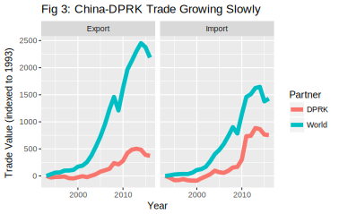
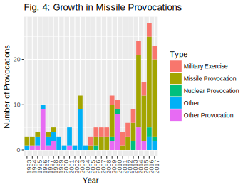
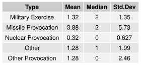

# Chinese Foreign Policy Priorities in the Korean Peninsula

## Introduction

​	In this paper I will explore how China's perceptions and foreign policy priorities change in response to different degrees and types of provocation on the Korean peninsula. The Korean peninsula has been host to significant and frequent military exercises, missile tests, and nuclear tests. China has been given a unique opportunity to demonstrate regional leadership, and a challenge to protect its own security. Historically, China has remained opaque about its foreign policy. This behavior is best explained by Deng Xiaoping's '24 character strategy' [^tf-character]:

>Observe calmly; secure our position; cope with affairs calmly; hide our capabilities and bide our time; be good at maintaining a low profile; and never claim leadership.

This paper aims to reveal how China has balanced its foreign policy goals in the presence of multipolar military provocation and economic stake on the Korean Peninsula. In doing so, it will answer the question: at what point do the stakes of economic integration fail to hold broader geopolitical ambitions?

​	First, I will investigate the role of China's trade relationships and economic interdependence in the context of the Korea peninsula. There are likely two extremes that these trade relationships fall under: (i) incentives for peaceful relationships and (ii) policy options to achieve foreign policy goals. These two extremes reflect the idea that under ideal conditions China would want to maximize its gains from trade, but when other priorities are perceived to be more important, the state may forego gains in the short term. In essence, there is a dichotomy of economic interdependence being a priority unto itself as well as a means to achieve other priorities.

​	I hypothesize that Chinese trade relationships with the United States and Republic of Korea (RoK) act predominantly as incentives for a peaceful relationship, while the relationships with the Democratic People's Republic of Korea (DPRK) and Japan are more commonly used as policy tools to achieve other goals. In the case of the DPRK, these goals may include a peace treaty or denuclearization on the Korean peninsula. In the case of Japan, they may relate to the Korean peninsula or to disputed territories. This assumption is based on how important the United States and RoK are as trading partners with China, relative to Japan and the DPRK. Japan and the DPRK have a weaker bargaining position with China; thus, the two countries are more vulnerable to Chinese attempts at leveraging its economic power. I expect that increased levels of provocation have an inverse relationship with the trade flows between China and the DPRK.

​	Next, this paper will evaluate how important China considers denuclearization relative to its other foreign policy goals. By examining Chinese diplomatic messaging, including UN Security Council speeches, we can infer the relative importance of denuclearization in China's foreign policy agenda. UNSC speeches offer an important opportunity for China to signal its priorities to actors active on the Korean peninsula, since many of them have ambassadors sitting on the Council. Although this stated preference model relies on China's diplomats to be somewhat transparent about their priorities, they have every incentive to do so given the signalling power of the speeches. I predict that in the presence of accelerating nuclear-related provocation, Chinese messaging on the issue becomes stronger and more focused on specific denuclearization efforts.

​	This analysis will contribute perspective on how a regional power reacts to a crisis when it has several roles, including leader, mediator, and stakeholder. This has potential to offer two key inferences: how China and other regional powers may behave in other similarly provocative situations, and which factors are determinants of this behavior.

## Literature Review and Theory

​	While there are theoretical perspectives and events that support both sides of the economic interdependence dichotomy, the evidence that it is a dominant foreign policy priority is increasingly better at explaining Chinese relationships relevant to the Korea peninsula. Despite China's current and past attempts to use economic leverage to achieve its foreign policy priorities, I believe that economic interdependence acts primarily as an incentive for mutualistic relationships.

​	In 2010, John Mearsheimer provided a theoretical perspective that predicted China's modernization would lead to the state seeking regional hegemony and using its position of power to achieve its foreign policy priorities.[^mearsheimer] Although Mearsheimer's analysis focused on the Chinese challenge to the power of the United States in the region, the perspective predicts that China would use its economic interdependence with its neighbors to achieve specific foreign policy goals, rather than allowing that economic interdependence to determine the state's priorities. There is support for this prediction in recent events regarding the peninsula, particularly in the case of the China-DPRK relationship. However, I believe these events are outliers, and China will increasingly prioritize its trade relationships higher in its foreign policy.

​	One of the most prominent examples of China using its economic leverage to achieve other foreign policy priorities occurred in 2017. In the first quarter of the year, China reported a substantial and mostly export driven increase in trade with North Korea of 37.4%, despite a ban on coal imports put in place in February.[^trade-early-2017] In the following months, the North Korean regime initiated several missile tests, and by the end of the year China-DPRK trade saw a reduction of 10.5% compared to 2016.[^trade-2017] Furthermore, the DPRK Budget Report for 2017 noted a slow down in economic growth in special economic zones, which are an important source of economic interdependence with China.[^budget-report] It seems clear from this example that China does not hesitate to use its trade relationships as tools to achieve foreign policy priorities; indeed, this is some of the strongest evidence to support such an idea. However, there is good reason to believe that the China-DPRK trade relationship is unlike many of its other relationships. Trade with the North Korean regime is only a small portion of China's economy, and in a situation with stronger economic interdependence the results may be quite different.

​	In 2017, China also attempted to use economic leverage against the Republic of Korea in response to the deployment of the THAAD missile defense system.[^glaser-collins] However in this instance, the effort had considerably less impact and the sanctions were removed in a short time frame. Before reconciliation of the dispute, China claimed that the RoK made three commitments.  Called the 'three nos', the commitments ruled out US missile defense system integration, a trilateral military alliance with the US and Japan, and no additional deployments of THAAD. According to the RoK, these commitments were not promises made to China, but instead long standing foreign policy. Importantly, the 'three nos' did not include a walk back of the existing THAAD deployments in the RoK. In the case of the DPRK, there have been commitments to close nuclear test sites.[^nuclear-test-site] While China may attempt to use economic leverage to its advantage, the success of this policy is limited for trade relationships that are highly interdependent.

​	There are convincing theoretical perspectives that support the notion of economic interdependence being an incentive for cooperative relationships and a goal unto itself. For example, the democratic peace theory stresses that interdependence and strong trade relationships create opportunities for communication by fostering cross-border social and business ties.[^rand] In this perspective, well connected interests have too much to lose from instability and pressure their respective states to deescalate economic conflict. This process has echoes of intergroup contact theory, which has shown contact between different cultural groups to lead to lower levels of prejudice.[^contact-theory] The presence of decreased prejudice among economic leaders could plausibly complement the strong incentives for peace, diminishing the influence of national identity on the process of dispute resolution. However, this only occurs when the economies in question are sufficiently well connected and integrated. Thus, China may selectively continue to use economic leverage only on states and actors it is only marginally connected with.

​	According to Avery Goldstein, the economic and institutional ties between China and North East Asian actors such as the US and RoK are so central to China's continued modernization that it is unlikely they will be sacrificed for other foreign policy priorities.[^goldstein] He points to the increasing willingness of China to fulfill a leadership position, through both public and discrete diplomatic missions and negotiations, as evidence of the strength of these ties. Furthermore, Goldstein notes that Chinese statements have emphasized the need to contain, rather than counter, tensions. This aligns with a 2017 Council on Foreign Relations report that claims one of China's top priorities for the Korean peninsula is stability.[^council-foreign-relations]

​	If it is true that economic interdependence plays such a dominant role in China's geopolitical calculus, then options to pursue other foreign policy goals such as denuclearisation become limited. Last year, Nicholas Anderson published a paper describing an intriguing idea of a 'nuclear trilemma' for the US on the Korean peninsula. In the paper, he asserts that the US cannot achieve denuclearisation without going to war or abandoning forward deployment in Korea.[^anderson] While this trilemma may not exist, the tradeoffs outlined by Anderson are thought provoking. China likely faces similar tradeoffs in its foreign policy, and it is unclear when these tradeoffs will lead to economic incentives being deprioritized.

## Research Design

​	For the topic of economic interdependence, the first test will aim to determine China's willingness to use economic leverage as a tool to achieve other foreign policy goals. The dependent variable in this test is the China-DPRK trade relationship. From the UN Comtrade Database, yearly data for imports and exports in dollars between China and the DPRK is available. Representing geopolitical circumstances undesirable to China, provocations by the DPRK regime serve as the independent variable. The exact date of these provocations is available, so they will be grouped in years to make comparison with the trade data simpler. Then, exports and imports will be regressed on provocations in the same year and lagged years. While the dataset of provocations compiled by BeyondParallel has a long time span and is very precise in its event times, the trade statistics are more challenging. The first issue is that the data is not precise, since only annual totals are available through the UN Comtrade Database. Secondly, data for 2017 has not been reported yet.

​	The second test will focus on China's trade relationships with other North East Asian actors, particularly the Republic of Korea, Japan, and the United States. Similarly, the UN Comtrade Database will be a source for annual US dollar denominated export and import totals. However, this test will use said data as the independent variable. The dependent variable will attempt to measure China's desire for a peaceful relationship with the North East Actors in question and specifically in regards to the Korean peninsula. Using several sources, including China's UN Security Council speeches, DPRK ambassador press releases, and state news articles, strength of messaging will be evaluated lexicographically and serve as the dependent variable.

### Data and Results

​	In evaluating the data, I will first frame the results with descriptive analysis of the individual datasets, then test the hypotheses and relate the datasets to each other. The data on trade flows has a wide scope, and I have gathered annual flows from 2003 to 2016. In the first two graphs, total flows and flows with the US and its North East Asian allies are shown.

​	This figure is important because it demonstrates the magnitude of Chinese exports and imports, which peak at $2.3 trillion and nearly \$2 trillion, respectively. Another notable detail is that while US, Japanese, and South Korean trade flows are discernible in comparison to China's total flows, Chinese trade with the DPRK is minute relative to China's flows with the rest of the world.

​	With a more detailed view of Chinese trade with US and its North East Asian allies, two important facts become apparent. The first is that growth in exports to the US has far outpaced any other flow. Second, flows have mostly declined since 2014 in line with the trend for China's total trade flows. An important implication of this is that it decreases incentives for maintaining peaceful conditions. I would expect that this decrease in flows would lead China to be less susceptible to external influence and less likely to compromise.

​	Since 2003, China-DPRK trade flows have grown substantially. The largest bumps occurred between 2010 and 2011 for both imports and exports. One possible explanation for this increase is a reduction in DPRK-RoK trade following the sinking of the Cheonan, but the figure below shows that fewer missile provocations occurred in 2010 and 2011 than the years prior. Another critical note is that China-DPRK trade flows did not decrease substantially in 2014, 2015, or 2016. Instead, they mostly followed the trend of China-World trade. This is surprising, since during these years, the DPRK initiated a substantial amount of missile provocations. Despite these high levels of provocation, China did not put severe sanctions in place until 2017.

​	Starting in 2003, with the DPRK withdrawal from the NPT, this subset of beyondparallel's provocation events reveals several important features of provocation on the Korean peninsula. First, military exercises have been routine and consistent. Since 2005, there have been military exercises every year. Next, I would like to shift attention to nuclear provocations, which have been more intermittent in frequency but fairly consistent in amount. With the recent collapse of one of the DPRK's nuclear facilities, it is likely that nuclear provocations will be low frequency in the short term. Because there have not been significant increases in military exercises or nuclear provocations, there is some uncertainty how actors in the region may behave if this did occur. The final and most important detail I would like to highlight is the high degree of variation in number of missile provocations each year: the standard deviation for annual missile provocations is larger than the mean. The distribution is also skewed to the right, with a mean exactly twice its median. Between 2014 and 2017, missile provocations exploded in amount; in that period missile provocations are several times the amount prior to 2014. This is a substantial shift in behavior, and I would like to point out again that China only instituted severe economic leverage in 2017, which is considerably late compared to when the DPRK began accelerating its rate of missile provocations.

​	This final figure aims to map the frequency of mentions of Chinese foreign policy goals and interests in the state's UN Security Council speeches on the subject of the DPRK. The dataset consists of 16 speeches by Chinese officials between late 2014 and 2018. Eleven speeches occurred in 2017, three in 2016, and one each in 2015 and 2014. Prior to 2014, China had not spoken on the subject of the DPRK since 2009, and there have been no speeches on the subject in 2018 so far. This lack of data availability is challenging, but also telling. The UN Security Council meetings dedicated to the subject of the DPRK has rapidly increased as provocations have sustained high levels.

​	The keywords were chosen by examining the most common words used in proximity to the word "interest" and various variations and synonyms of the word, including "goal" and "concern". Then, the number of mentions of each of these keywords was counted for each speech. While the four keywords may ostensibly seem similar, a nuanced view would note that they are potentially contradictory. For example, denuclearization on the Korean peninsula may be extremely difficult to achieve without sacrificing short term peace and stability. For this reason, the substantial decline in mentions of peace and security with a simultaneous climb in mentions of denuclearization is quite worrying. Of course, these trends should be viewed with some important caveats in mind. The first, data availability, was mentioned above. If another round of UN Security Council meetings regarding the DPRK occurs in the future, there is reason to believe that China will have a different set of goals and interests. The other caveat is that this figure provides no information on the context of the keyword mentions. Lexicographical analysis would need to be used to determine subjective details about China's speech, such as strength or weakness of messaging.

## Bibliography

[^tf-character]: Office of the Secretary of Defense. "Military and Security Developments Involving the People’s Republic of China, 2015". Page 22.
[^trade-2017]: Tan, Huileng. "China's trade with North Korea dropped sharply in 2017". CNBC. 2018-01-11.
[^mearsheimer]: Mearsheimer, John J. "The Gathering Storm: China’s Challenge to US Power in Asia". The Chinese Journal of International Politics, Vol. 3, 2010, 381–396.
[^trade-early-2017]: Perlez, Jane and Yufan Huang. "China Says Its Trade With North Korea Has Increased". New York Times. 2017-04-13.
[^budget-report]: Frank, Ruediger. "The North Korean Parliamentary Session and Budget Report for 2017". 38North. 2017-04-28.
[^glaser-collins]: Glaser, Bonnie S. and Lisa Collins. "China's Rapprochement With South Korea: Who Won the THAAD Dispute?". Foreign Affairs. 2017-11-07.
[^nuclear-test-site]: The Associated Press. "North Korea to close nuclear test site in May, Seoul says". 2018-04-28.
[^rand]: Szayna, Thomas et. al., The Emergence of Peer Competitors: A Framework for Analysis, Appendix C “The Democratic Peace Idea.” (RAND Corporation, 2001).
[^contact-theory]: Pettigrew, Thomas F. and Linda R. Tropp. Journal of Personality and Social Psychology, Vol. 90, No. 5, 2006, 751–783.
[^goldstein]: Goldstein,  Avery. “Power Transitions, Institutions, and China's Rise in East Asia: Theoretical Expectations and Evidence”. Journal of Strategic Studies, Vol. 30, No. 4, 2007, 639-682.
[^xuetong]: Xuetong, Yan. "From Keeping a Low Profile to Striving for Achievement". The Chinese Journal of International Politics, Vol. 7, No. 2, 2014, 153–184.
[^anderson]: Anderson, Nicholas D. "America’s North Korean Nuclear Trilemma". Washington Quarterly, Vol. 40, No. 4, 2017, 153-164.
[^council-foreign-relations]: Albert, Eleanor. "The China–North Korea Relationship." Council on Foreign Relations, March 2017.
